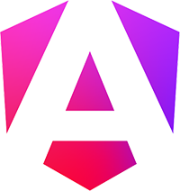

Ce projet vise à créer une plateforme en ligne complète et collaborative recensant les entreprises mauritaniennes 🇲🇷

L'objectif est de fournir une ressource centralisée pour les chercheurs d'emploi 👨‍💼 et les étudiants à la recherche de stages 👩‍🎓 tout en permettant aux entreprises d'accroître leur visibilité ✨

## Soyez un acteur du changement ! 💌

En tant qu'employé actuel ou ancien, ou encore en tant que stagiaire, vous avez la possibilité de contribuer à l'enrichissement de ce répertoire en partageant votre expérience au sein d'une entreprise mauritanienne.

Vos précieuses informations permettront de compléter les fiches d'entreprise et seront consultables par tous les utilisateurs de la plateforme. N'hésitez pas à partager votre vécu et à aider la communauté à mieux connaître le paysage entrepreneurial mauritanien !

## Guide de contribution 📝

<a href="./CONTRIBUTING.md">CONTRIBUTING.md</a>

## Technologies utilisées 🛠️

Ce projet utilise le framework Angular (https://angular.dev/) pour le développement front-end.

On utilise aussi TailwindCSS (https://tailwindcss.com/) pour le style et on essaye au maximum d'éviter d'écrire du code CSS
  
D'autres technologies peuvent être envisagées pour la partie back-end (TBD)

## Installation et prérequis 🧰

### Prérequis

* Node.js et npm installés sur votre machine (https://nodejs.org/). Vous pouvez vérifier leur présence en exécutant les commandes node -v et npm -v dans votre terminal.

### Installation Angular
* Ouvrez votre terminal et exécutez la commande suivante pour installer Angular CLI globalement :
`npm install -g @angular/cli`

## Execution du projet en local 💻

* Naviguez vers le répertoire du projet : `cd entreprises`
* Démarrez le serveur de développement : `ng serve`

## Contribution 🙌
Nous encourageons vivement la participation de la communauté à l'enrichissement de ce répertoire.

## Avertissement 📢

Les informations fournies sur les entreprises sont soumises par la communauté et n'engagent pas la responsabilité des contributeurs ou des administrateurs du site. Nous invitons les utilisateurs à vérifier les informations auprès des entreprises directement.

Si vous remarquez une information inexacte sur votre entreprise ou souhaitez que les informations la concernant soient retirées, veuillez nous contacter. Nous nous efforcerons de rectifier ou de supprimer les informations dans les meilleurs délais.

## Démarrer ⏯️

Vous êtes convaincu par ce projet ? Consultez ce dépôt GitHub pour le code source et les instructions de contribution.

N'hésitez pas non plus à proposer des améliorations et des suggestions pour faire de ce répertoire d'entreprises mauritaniennes une ressource incontournable !

## Contact 📲

Pour rester connecté et interagir avec la communauté, nous vous invitons à rejoindre nos canaux de discussion :

#### Serveur Discord : https://discord.gg/wsbsd7e8
#### Groupe WhatsApp : https://chat.whatsapp.com/Ic6bnLZJHqZARB8RG6kalk

Nous espérons vous voir bientôt sur nos canaux de discussion !
